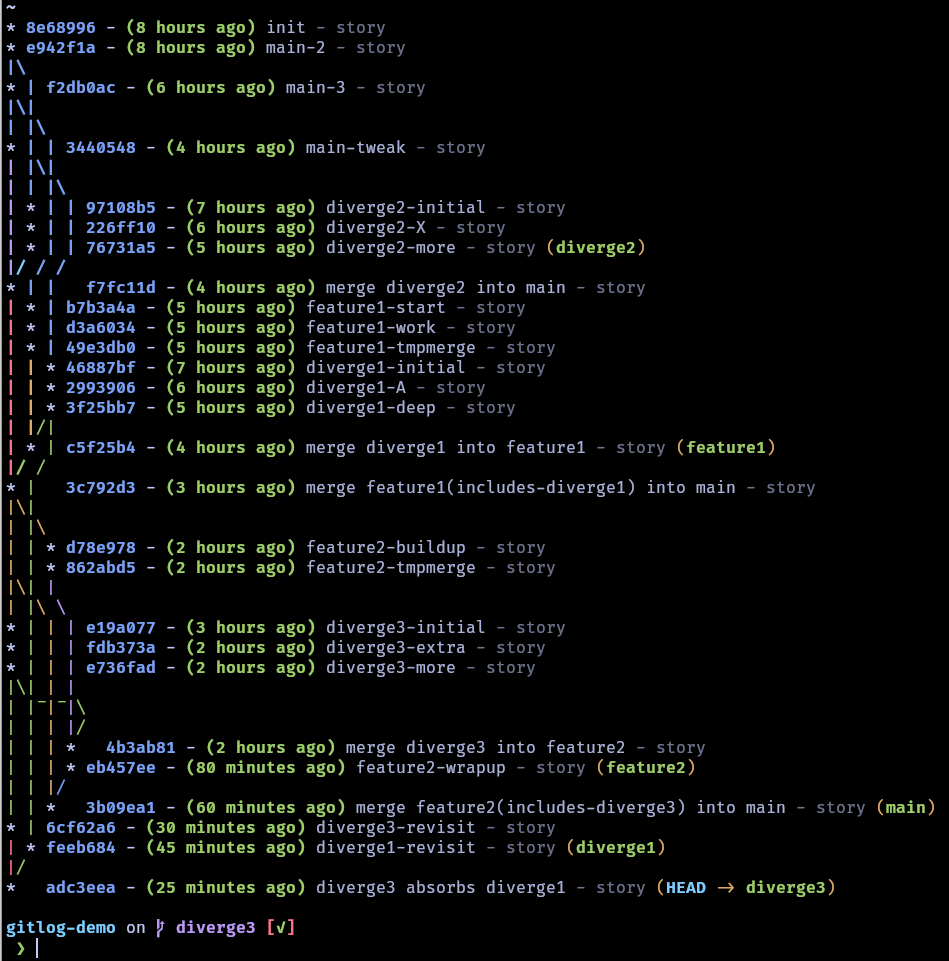

# Inverted `git log --graph`
Using git log --graph is nice, but I dislike that the most relevant commits, are shown at the top of
the terminal screen, specially if like me your terminal will scroll by 2 lines quitting the pager.

You can use `tac` to invert the output, however the graph will need adjustments to be properly drawn.
This script substitutes:
| From | To |
| -------------- | --------------- |
| \ | / |
| / | \ |
| _ |  ̅ |


```python
import re
import sys

# Define substitution mappings and placeholder
FORWARD_SLASH = "/"
BACKSLASH = "\\"
PLACEHOLDER = "<<<SWAP_PLACEHOLDER>>>"

# Partition can be short hash or >=10 whitespaces
partition_re = re.compile(r"([0-9a-f]{7,12})|(\s{10,})")


def substitute_before_partition(line):
    match = partition_re.search(line)
    if match:
        idx = match.start()
        before = line[:idx]
        after = line[idx:]
    else:
        before = line
        after = ""
    before = before.replace(FORWARD_SLASH, PLACEHOLDER)
    before = before.replace(BACKSLASH, FORWARD_SLASH)
    before = before.replace(PLACEHOLDER, BACKSLASH)
    before = before.replace("_", " \u0305")

    return before + after


if __name__ == "__main__":
    for line in sys.stdin:
        print(substitute_before_partition(line.rstrip("\n")))
```

Then we can combine the script with `tac` and `less`, to have essentially the same behavior as the original `git log --graph`, but inverted:
```bash
git log --graph 2>&1 | tac | python git_log_graph_invert_characters.py | less -FX +G
```


## Bonus Tip: ZSH Completions on alias
If you use just an alias, in your config you'll lose the completions provided by zsh.
If you set up the alias as a function, you can retain completions. For example, when you want to look at a few branches, the git completions will show the available branches, and if you use fzf, you can easily select one.

For zsh to provide completions on the new commands you need to use a function and `compdef`. In your `.zshrc`, place the function definitions and after them, use `compdef`:

```bash
invert_gitgraph() {
  local cmd="$1"; shift
  "$cmd" "$@" 2>&1 | tac | python <path to git_log_graph_invert_characters.py> | less -FX +G
  # WARN: make sure to set the path to git_log_graph_invert_characters.py according to your system
}

gitgraph() {
  git log --graph --oneline --color
}

gl() { invert_gitgraph gitgraph "$@"; }

compdef _git gl=git-log
```

For extra reference you can check my [nixos-config](https://github.com/jonboh/nixos-config/blob/4f73db645fb90d68cf2daf942bd6aa0fb120478f/home-manager/shell.nix#L81).

Here's an example of what it looks like:

