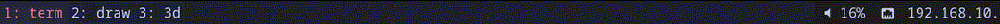
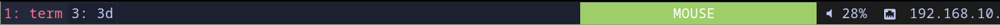

I use a lot of layers on my [ULP Dactyl](https://github.com/jonboh/ulp-dactyl).
I use most layers with the QMK `MO()` modifier, which means that I have to hold
the modifier to keep a given layer active, ergonomically it is usually preferred
to use toggle layers (`TO()` modifier), however I don't usually find them very
quick to work with (and a bit disorienting). As most of the time I have to keep
layers active for a small time window (like typing a couple of symbols), my
thumbs don't feel strained.

However my mouse layer is a different story, I've recently felt some strain on my thumb from keeping too
much time my mouse layer active. One of the reasons I dont like toggle layers is that I didn't have a
good feedback method for knowing which layer was currently active. And LEDs on the keyboard are not an option,
I don't look at my keyboard while writing. Enter the [Raw HID QMK interface](https://docs.qmk.fm/features/rawhid).
This interface allows us to communicate back and forth with the keyboard.

I've set up a very simple communication scheme, by which I tell the computer whenever the mouse layer
or scrolling variable gets toggled. This, combined with the signals functionality of
[i3status-rs](https://github.com/greshake/i3status-rust/), allows me to show a modal indicator similar
to VIM's.

This method can be extended to present any other relevant information coming from the keyboard.

You can check my whole [QMK firmware config](https://github.com/jonboh/qmk_firmware/blob/master/keyboards/ulp_dactyl/keymaps/default/keymap.c),
but I'll present here just the relevant snippets.
First we define some functions for sending the appropriate reports through the HID interface. Also, as I don't use the
interface for anything else, any report sent from the host is taken as a request for an updated status report (see `raw_hid_receive`).

```c
void send_mouse_active(void) {
    uint8_t length = 32;
    uint8_t response[length];
    memset(response, 0, length);
    response[0] = 'M'; // Mouse active
    raw_hid_send(response, length);
}

void send_mouse_active_scrolling(void) {
    uint8_t length = 32;
    uint8_t response[length];
    memset(response, 0, length);
    response[0] = 'S'; // Scroll active
    raw_hid_send(response, length);
}

void send_mouse_inactive(void) {
    uint8_t length = 32;
    uint8_t response[length];
    memset(response, 0, length);
    response[0] = 'K'; // Keyboard active
    raw_hid_send(response, length);
}

void raw_hid_receive(uint8_t *data, uint8_t length) {
    if (IS_LAYER_ON(MOUSE)) {
        if (set_scrolling) {
            send_mouse_active_scrolling();
        } else {
            send_mouse_active();
        }
    } else {
        send_mouse_inactive();
    }
}
```

We will use the `send_mouse_*` functions in `layer_state_set_user` and at the
point where we modify the `set_scrolling` variable, in my case this is
`process_record_user`. Depending on how you handle scrolling your config might
vary. I define a custom `MOUSE_TRACK_SCROLL` keycode with which I toggle
between scrolling and normal mouse.

```c
layer_state_t layer_state_set_user(layer_state_t state) {
    if (IS_LAYER_ON_STATE(state, MOUSE)){
        if (set_scrolling) {
            send_mouse_active_scrolling();
        } else {
            send_mouse_active();
        }
        // other functionality
    } else {
        send_mouse_inactive();
        // other functionality
    }
  return state;
}

bool process_record_user(uint16_t keycode, keyrecord_t *record) {
    // .. other functionality
    switch (keycode) {
        case MOUSE_TRACK_SCROLL:
            if (record->event.pressed ) {
                set_scrolling = !set_scrolling;
                if (set_scrolling) {
                    send_mouse_active_scrolling();
                } else {
                    send_mouse_active();
                }
                return false;
            }
            break;
        // .. other cases
    }
      // .. other functionality
}
```

At this point if you flash your keyboard, in my case:
```bash
qmk flash -kb ulp_dactyl -km default -e CONVERT_TO=promicro_rp2040
```

You can listen to reports with this python script to debug it:
Note that you will need to adjust the `vendor_id` and `product_id` according to your keyboard, by default
`0xFEED` and `0x0000` respectively.

```python
import sys
import hid

vendor_id = 0xFEED
product_id = 0x0000

usage_page = 0xFF60
usage = 0x61
report_length = 32

def get_raw_hid_interface():
    device_interfaces = hid.enumerate(vendor_id, product_id)
    raw_hid_interfaces = [
        i
        for i in device_interfaces
        if i["usage_page"] == usage_page and i["usage"] == usage
    ]

    if len(raw_hid_interfaces) == 0:
        return None

    interface = hid.Device(
        vid=vendor_id, pid=product_id, path=raw_hid_interfaces[0]["path"]
    )

    print(f"Manufacturer: {interface.manufacturer}")
    print(f"Product: {interface.product}")

    return interface


def receive_raw_report():
    interface = get_raw_hid_interface()
    print("Waiting for report...")
    try:
        while True:
            if interface is None:
                print("No device found")
                sys.exit(1)

            response_report = interface.read(report_length, timeout=1000)

            if response_report:
                print("Response:")
                print(response_report)
    except:
        interface.close()


if __name__ == "__main__":
    receive_raw_report()
```

Depending on your system you might need to run the script as root, if your user does not have access to the hidraw interface.

To avoid having to run i3status with privileges to read hid devices, I use a systemd service unit that runs as root,
reads from the device and writes into a temporary file with relaxed permissions (666) in `/tmp/keyboard_status`.
Each time the service writes into the file it sends a signal to `i3status-rs`, that way we get immediate update on the status bar, instead of having a slight delay if we were to use an interval of 1 second.
```toml
[[block]]
block = "custom"
command = "python /home/jonboh/.flakes/system/extra_configs/i3/keyboard_status_client.py"
json = true
hide_when_empty = true
interval = "once"
signal = 1
```

The `keyboard_status_client.py` which is run by `i3status-rs` has the following content:
```python
import json
import os


def make_active_mouse_json():
    whitespace = " " * 10
    return {"text": f"{whitespace}MOUSE {whitespace}", "state": "Critical"}


def make_active_scroll_json():
    whitespace = " " * 10
    return {"text": f"{whitespace}SCROLL{whitespace}", "state": "Warning"}


if __name__ == "__main__":
    file_path = "/tmp/keyboard_status"

    if os.path.exists(file_path):
        with open(file_path, "r") as file:
            keyboard_status = file.read().strip()
            if keyboard_status == "M":
                print(json.dumps(make_active_mouse_json()))
            elif keyboard_status == "S":
                print(json.dumps(make_active_scroll_json()))
            else:
                print("{}")
```

Then in a systemd service unit, which runs `keyboard_status_server.py` I read from the hidraw device:

```python
import signal
import subprocess
import sys

import hid

## Keyboard RAW HID Interface
vendor_id = 0xFEED
product_id = 0x0000

usage_page = 0xFF60
usage = 0x61
report_length = 32

file_path = "/tmp/keyboard_status"
signal_num = signal.SIGRTMIN + 1


def get_raw_hid_interface():
    device_interfaces = hid.enumerate(vendor_id, product_id)
    raw_hid_interfaces = [
        i
        for i in device_interfaces
        if i["usage_page"] == usage_page and i["usage"] == usage
    ]

    if len(raw_hid_interfaces) == 0:
        return None

    interface = hid.Device(path=raw_hid_interfaces[0]["path"])

    return interface


def listen_for_updates():
    interface = get_raw_hid_interface()
    if interface is None:
        print("No device found")
        sys.exit(1)
    while True:
        response_report = interface.read(report_length)
        response = chr(response_report[0])
        with open(file_path, "w") as f:
            f.write(response)
            f.flush()
        print(f"response: {response}")
        subprocess.run(["pkill", "-{}".format(signal_num), "i3status-rs"])


if __name__ == "__main__":
    listen_for_updates()
```

I use NixOS, so I define the systemd unit using Nix:
```nix
  systemd.services.ulpdactyl_status = let
    python = pkgs.python3.withPackages (ps: [ps.hid]);
  in {
    enable = true;
    enableStrictShellChecks = true;
    path = [pkgs.procps];
    serviceConfig = {
      ExecStart = "${python}/bin/python ${../../extra_configs/i3/keyboard_status_server.py}";
      Restart = "always";
      RestartSec = "5";
      User = "root";
    };
  };
```

Here I define a python interpreter with [pyhidapi](https://github.com/apmorton/pyhidapi), also the systemd
unit needs the `procps` package so that the script can run `pkill` to send the signal.

And that's all, at this point after rebuilding my system I have a nice modal indicator on my status bar :D

