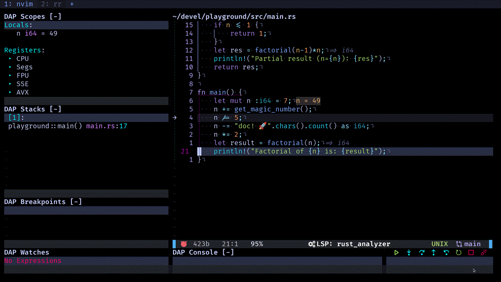
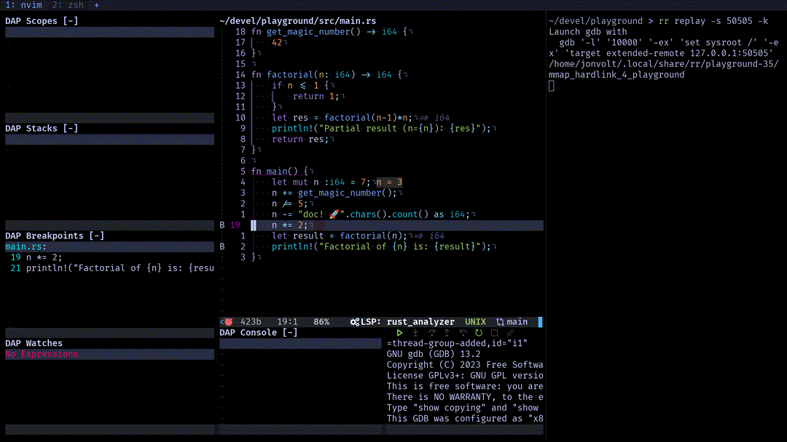

If you've spent any amount of time debugging software you know the amount of it
one can end up wasting just continuously restarting your program in order to 
pinpoint where in your code base a given problem is located.

Even when you've located the problem it is sometimes difficult to reason through
why things are not going according to plan in your code. Even more if you are
not debugging your own code (or you wrote it more than two weeks ago).

Since I've been developing in Rust, the amount of time that I've spent debugging has
decreased dramatically. All those compile time guarantees and expressiveness in the type
system reduce the opportunities for bugs to creep in. But, once I need to debug something
the flexibility of moving back and forth increases my productivity when a bug with
sufficient teeth comes up.

## Wouldn't it be nice if you could just go back?
Well that's preciesly what [rr](https://rr-project.org/)
allows you to do. Look right here:



So how do you acquire this power? And how do you use it?

We are going to configure `rr` for NeoVim, using the DAP (Debugger Adapter Protocol),
which most modern editors can handle. I've made a [plugin](https://github.com/jonboh/nvim-dap-rr/tree/main) to handle most of the
details of integrating `rr` with the [vscode-cpptools](https://github.com/microsoft/vscode-cpptools)
extension that is used to bring `gdb` to neovim through the DAP.

If you use a different editor you could always check the code and adapt the logic to
your editor, or use gdb directly.

## rr Basics
Depending on your Linux distro you might need to set the `perf_event_paranoid` level
to allow `rr` to work.
```
sudo sysctl kernel.perf_event_paranoid=1
```

In general you will first record an execution of your program with:
```
rr record <path/to/your/binary> <args>
```
This will generate a recording. To execute the recording run:
```
rr replay -s 50505 -k
```
This command will serve the replay session for you to connect to. You will be able to
see in the response of the command the instructions to connect to the session by gdb.

We will however connect from our NeoVim editor using [nvim-dap-rr](https://github.com/jonboh/nvim-dap-rr/tree/main).

## NeoVim configuration
The plugin makes most of the heavy lifting, for local sessions you only need to set the mappings
of the debugger actions and append the generated configuration to your `dap.configurations` table.
For remote sessions or other debugger configurations see the 
[plugin readme](https://github.com/jonboh/nvim-dap-rr#debugger-configuration)
Here is the minimal configuration:
```lua
local dap = require('dap')

-- point dap to the installed cpptools, if you don't use mason, you'll need to change
-- `cpptools_path` to point to your installation
local cpptools_path = vim.fn.stdpath("data").."/mason/packages/cpptools/extension/debugAdapters/bin/OpenDebugAD7"
dap.adapters.cppdbg = {
    id = 'cppdbg',
    type = 'executable',
    command = cpptools_path,
}

-- these mappings represent the maps that you usually use for dap
-- change them according to your preference
vim.keymap.set("n", "<F1>", dap.terminate)
vim.keymap.set("n", "<F6>", dap.toggle_breakpoint)
vim.keymap.set("n", "<F7>", dap.continue)
vim.keymap.set("n", "<F8>", dap.step_over)
vim.keymap.set("n", "<F9>", dap.step_out)
vim.keymap.set("n", "<F10>", dap.step_into)
vim.keymap.set("n", "<F11>", dap.pause)
vim.keymap.set("n", "<F56>", dap.down) -- <A-F8>
vim.keymap.set("n", "<F57>", dap.up) -- <A-F9>

local rr_dap = require("nvim-dap-rr")
rr_dap.setup({
    mappings = {
        -- you will probably want to change these defaults so that they match
        -- your usual debugger mappings. They will override the normal dap::<fun>
        -- during rr debugging sessions
        continue = "<F7>",
        step_over = "<F8>",
        step_out = "<F9>",
        step_into = "<F10>",
        reverse_continue = "<F19>", -- <S-F7>
        reverse_step_over = "<F20>", -- <S-F8>
        reverse_step_out = "<F21>", -- <S-F9>
        reverse_step_into = "<F22>", -- <S-F10>
        -- instruction level stepping
        step_over_i = "<F32>", -- <C-F8>
        step_out_i = "<F33>", -- <C-F8>
        step_into_i = "<F34>", -- <C-F8>
        reverse_step_over_i = "<F44>", -- <SC-F8>
        reverse_step_out_i = "<F45>", -- <SC-F9>
        reverse_step_into_i = "<F46>", -- <SC-F10>
    }
})
dap.configurations.rust = { rr_dap.get_rust_config() }
dap.configurations.cpp = { rr_dap.get_config() }
```
Feel free to set the mapping to your liking, mine are set up to a [QMK](https://docs.qmk.fm/#/) layer
that leaves the `FN` keys on my home-row. So most of the stepping functions correspond
to hjkl on a QWERTY keyboard.

We are ready, put your glasses on, the flux capacitor sometimes throghs off sparks!

To start the debugging session you just need to have a `rr` session being served:
```
cargo build
rr record ./target/debug/playground
rr replay -s 50505 -k
```

Then in NeoVim press the key mapped to `continue`, in my case `F7`,
you'll be prompted to choose the binary that we are debugging.
Once connected to the debug session using the `step`, `reverse_step`, `continue` 
and `reverse_continue` functions, mapped to (`<F7-10>` and `<S-<F7-10>>` in my case)
you can freely navigate the state of your recording:



## Cool, but will this work on any program?
You might be worried that this might only work on toy programs or be insufferably slow
on any real application complex enough to benefit from this kind of debugging.
You'll be happy to know that `rr` is actually not that bad in this front, you can expect
your application to be 2 to 3 times slower than normal when using rr to record it.

Let me show you how you can debug [Clippy](https://github.com/rust-lang/rust-clippy), the Rust
linter with `rr`.

## Debugging Clippy with rr
When you develop in Rust it is very common to run your application using `cargo run`.
But in order to record the execution of our application this is not advisable, as we would be
recording the code of cargo itself.

I've recently started contributing to Rust, and I wanted to explore how the 
[enum_variant_names](https://rust-lang.github.io/rust-clippy/master/#/enum_vari) lint
worked, so in this example we'll use the `clippy-driver` binary with `test/ui/enum_variants.rs`
as its argument. This binary runs linter on this test file.

In the case of clippy, to run the linter without `cargo dev` we have to set `LD_LIBRARY_PATH`.
The easiest way to set it up is by running `clippy-driver` like this:
```bash
LD_LIBRARY_PATH=$(rustc --print target-libdir) ./target/debug/clippy-driver tests/ui/enum_variants.rs 
```

In order to record the execution we run:
```bash
LD_LIBRARY_PATH=$(rustc --print target-libdir) rr record ./target/debug/clippy-driver tests/ui/enum_variants.rs 
```

Then we serve the replaying:
```bash
rr replay -s 50505 -k
```

And finally we can debug on our editor:


In the gif I've placed a breakpoint in the `check_variant` function and using the `reverse_step_out`
function (keybinded) I'm able to set the state of the program to the moment just before `check_variant`
was called. 

I find this very helpful to look for the moment in which the state of my program stops being the expected.
At that point, instead of restarting the debugging, with `rr` you can just `reverse_step_out`, check if
the state is the expected one and repeat. Running a kind of bisecting search on your bug with the state 
of your program.

## Conclusion
As you've seen setting `rr` to debug your programs is reasonably easy and the configuration for integrating it
with NeoVim is as well using [nvim-dap-rr](https://github.com/jonboh/nvim-dap-rr).

In this case I've used `Rust`, but `rr` can be used to debug `C++` and `C` binaries as well.

`rr` opens a world of possibilities for debugging, on top of Rust already fantastic properties, it can help 
further decrease the amout of time you spend debugging.
