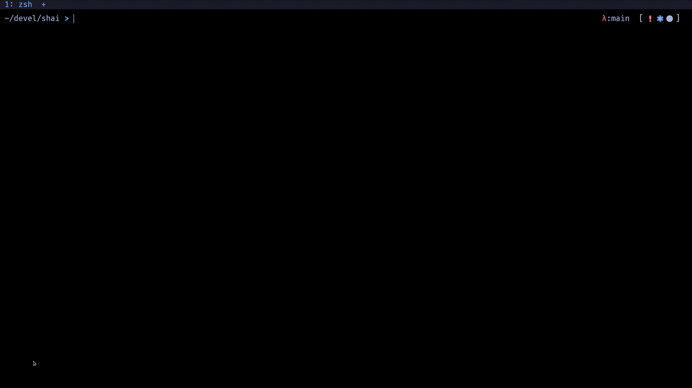

Shai is an assistant for the shell (shell ai).

Since I installed a plugin to have access to ChatGPT from NeoVim, I've found myself
opening the editor just to get a command that I was not able to remember or that
I wanted to know if there was a better way to write.

Shai has been developed with the intent to fill this function. Because I can spare
some time to write an app, but I won't tolerate spending 30 seconds in
something that could be done in 5. Jokes aside, shai can currently help you in two
main ways, which correspond to the two modes the application has.

See the github repo for [installation](https://github.com/jonboh/shai#installation)
and [usage](https://github.com/jonboh/shai#how-to-use-it) instructions.

## Command Generation
In this mode you ask shai to perform a task. Shai will generate a command according
to your prompt. If it looks ok, with a keyboard combination (`<C-a>`) you can directly 
write the command to your buffer line and inmmedately run it without the need to copy/paste.


Shai comes bundled with integration scripts for the main shells (that I know of):
- bash
- zsh
- fish
- nushell
- powershell

You can generate these scripts once shai is installed by running:
```bash
shai --generate-script <your-shell, one of {bash, zsh, fish, nushell, powershell}>
# e.g
shai --generate-script zsh > zsh_assistant.zsh
# then in your .zshrc
source zsh_assistant.zsh
```

With this functionality you'll be able to invoke shai with a key combination (`<A-s>` by default)
and let shai write its command on your buffer line when you accept its output (`<C-a>`).
No more copy/paste.

## Command Generation + Explanation
In addition to generating a command you can ask shai to explain the command right back,
that way you can further check that the command actually does what you expect.
A detail here to take into account is that the request to explain the command,
only includes the command, not the prompt that you entered to generate it. This
way we avoid biasing the model and contaminating its explanation with the original task.


## Command Explanation
You can ask for an explanation of the command that is currently written in the buffer line.
This can be useful when copying a command from some guide or forum. Again, thanks to the 
shell integration you can write a command on your cli, invoke shai, press enter, get your
explanation and be right back in the cli, without the need to copy and paste or typing a thing.


## Why a shell assistant
Up until not that long I was your run of the mill Windows user/developer, with a very
limited knowledge of how things actually work.
I think it is really important to get a grip on your technological stack and have at
least a rough idea of how your tools and system actually works. For this,
working on Linux and directly on the terminal for me was a turning point.
Linux exposes a lot of its details to the user and if you take the time to learn
the amount of control you end up having over your workflow, computer etc. is tremendous.
However, the beginning of this journey can be daunting, I hope shai will ease the path
for beginners (myself included).

Shai is not a substitute for knowing your commands, in fact the best results are achieved
when you already know the capability of a command and its nomenclature, but I think it can ease
the learning curve and exploration.

## Future Plans
Currently only OpenAI's GPT models are available, although I've kept the main app
decoupled from these models, so in principle any chat-like model could be implemented,
in fact I would love to add support for [OpenAssistant](https://github.com/LAION-AI/Open-Assistant)
if an API becomes available at some point.

I also plan on exploring running a model locally, RAM with these models can be a problem, but
I've heard that quantized versions still provide good results. If something in this
path is viable I'll add support at some point.
